<div id="container" style="white-space:nowrap">

  <div id="image" style="display:inline float: right;">
        
  </div>

  <div id="texts" style="display:inline; white-space:nowrap; float: right;"> 
        <h1>C#-Grundlagen</h1>
        <h3>Arbeitsauftrag zur Konsolenausgabe</h3>
</div>

## :dart: Zielsetzung

Dieser Auftrag hat folgende Ziele:

+ Einfache Programmierprobleme nutzen, um die Modul 1 behandelten Themen zu Vertiefen
+ Üben Informationen zu Recherchieren, die nicht explizit in der Aufgabenstellung genannt werden
+ Üben Sie das Erstellen, Klonen und Einreichen von Aufträgen über Visual Studio 2022 und GitHub

---

### Aufgabe 1: Der Geist
> :information_source: **Hinweise**:exclamation:
> + Beachten Sie, dass Sie die Ausgabe unter der gestrichelten Linie erzeugen müssen, um die Aufgabe zu bestehen
> + Sie müssen die Formatierung im Beispiel genau befolgen, um den Unittest zu bestehen


### Visual Studio Starten

windows suchleiste nach Visual studio 22 suchen und anclicken. 

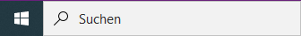

Wenn sich ein Popup offnet, klicken Sie auf "one Code fortfahren"

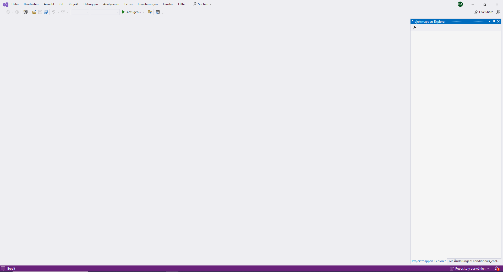

### Kontoeinstellungen vornehmen
Unter Datei/Kontoeinstellungen können Sie sich mit Ihrem Account Anmelden.

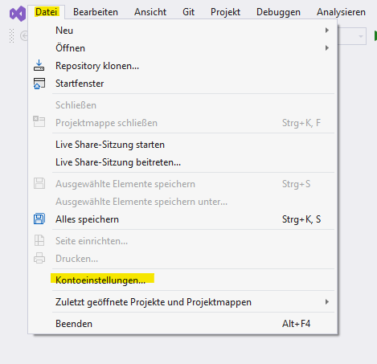

Klicken Sie auf anmelden und melden Sie sich mit Ihrer Schulemail in ihrem Microsoft konto an. 


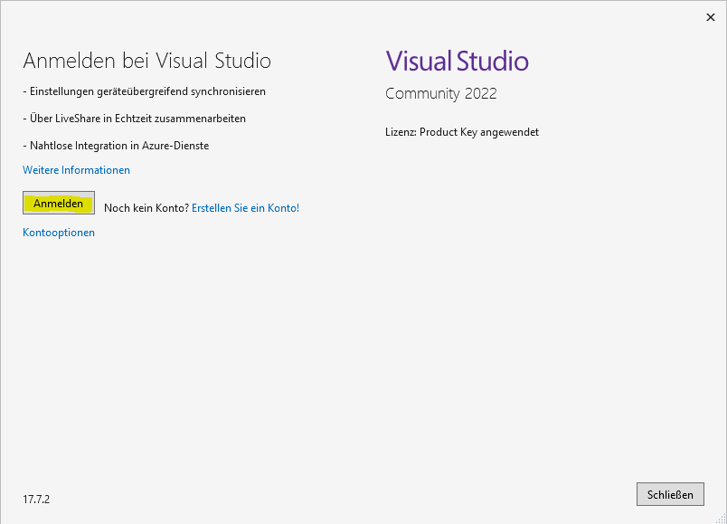

sollte dies nicht funtionieren, ändern Sie die den Browser zum Systembrowser unter Kontooptionen.


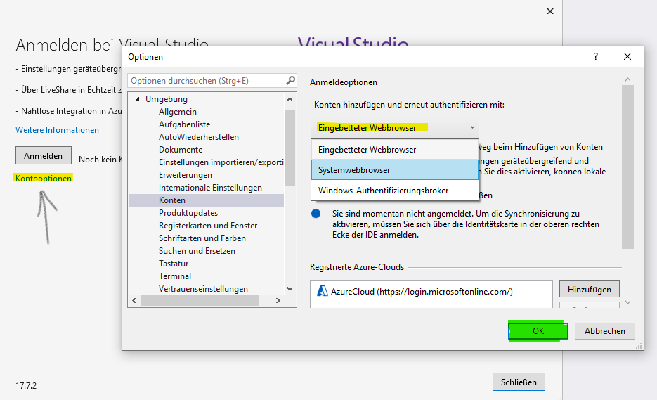

Sie können müssen nun noch Ihr GitHub Konto hinzufügen. 
Klicken Sie dafür auf **"Hinzufügen"** und w#hlen Sie GitHub aus.


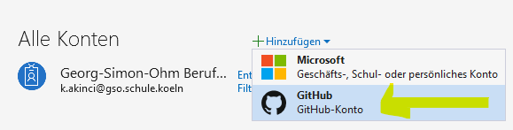


Wenn sie mit beiden Profilen erfolgreich angemeldet sind, sieht das folgendermaßen aus.


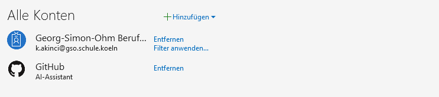

### Neue Projektmappe erstellen

Nun erstellen sie ein Konsolenprogramm das mit der Programmiersprache c# programmiert wird. 
Einkonsolenprogramm ist ein Programm das...

Klicken Sie auf Datei/Neu/Projekt

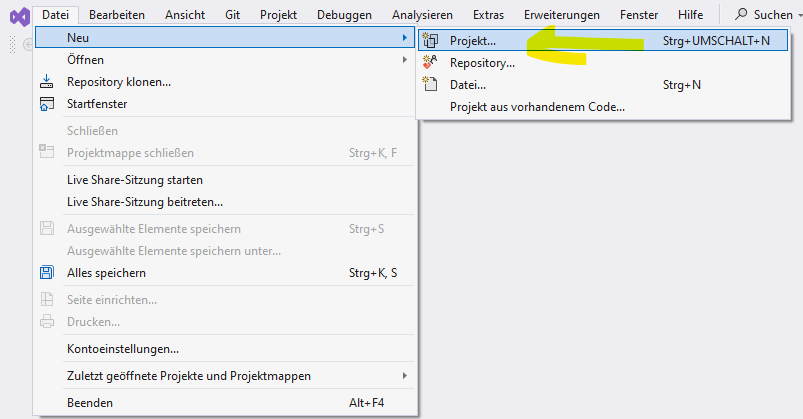


Suchen Sie in der Suchleiste die Konsolen.App. 
Achten Sie darauf, dass c# die gewählte Programmiersprache ist.

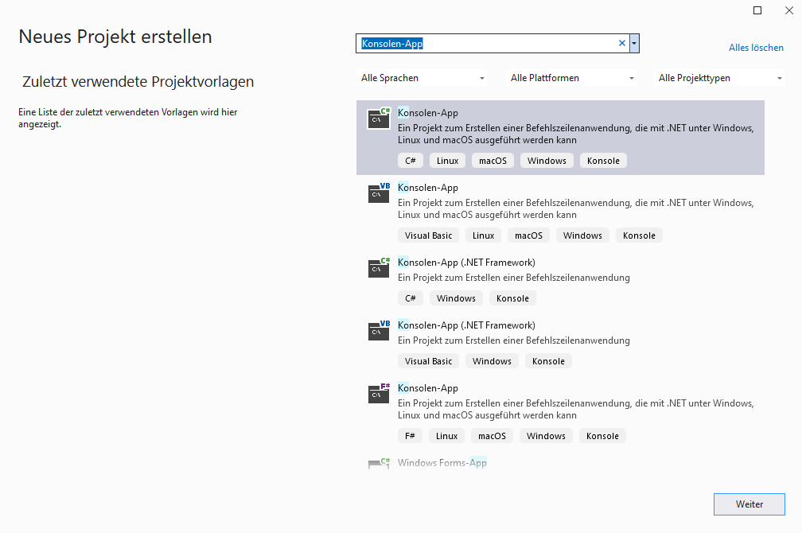

Konfigurieren Sie das Projekt so, das der Name der Projektmappe **"GrundlagenrepositoryCsharp"** (Erstes Feld) und das erste Projekt **"1_Elementare_Syntax"** (zweites Feld) ist. 
Die Repositorys werden meist im source Ordner des Benutzers gespeichert. 
Platzieren Sie die Projektmappe **nicht** im selben Verzeichnis wie das Projekt. 

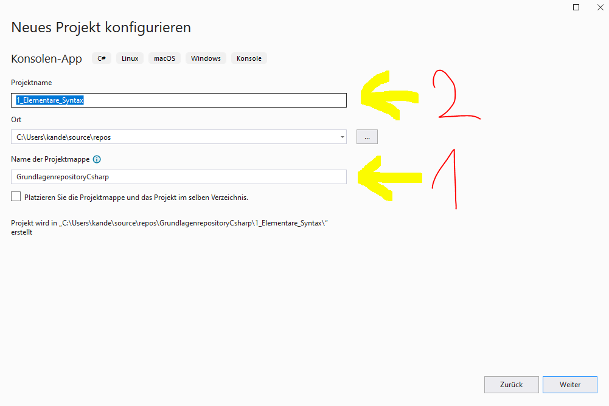


Wählen Sie die Framework-version .NEt 6 aus.

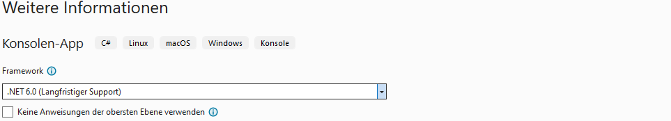

### Projekt starten

Um den Debugger zu starten, drücken Sie **F5** oder klicken Sie auf den grünen Pfeil.

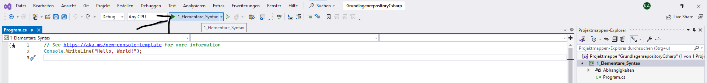

### Neues Projekt hinzufügen

Um ein neues Projekt hinzuzufügen klicken Sie die lilane Projektmappe mit der rechten Maustase an.

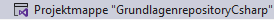

Fügen Sie ein neue Projekt hinzu.

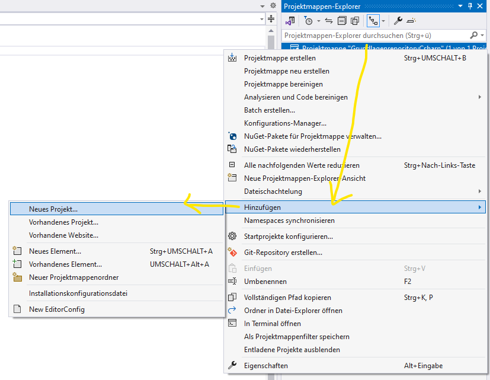

Geben Sie dem Projekt den Namen **"2_Konsolenausgabe"** und wählen Sie das .NET 6 Framework.

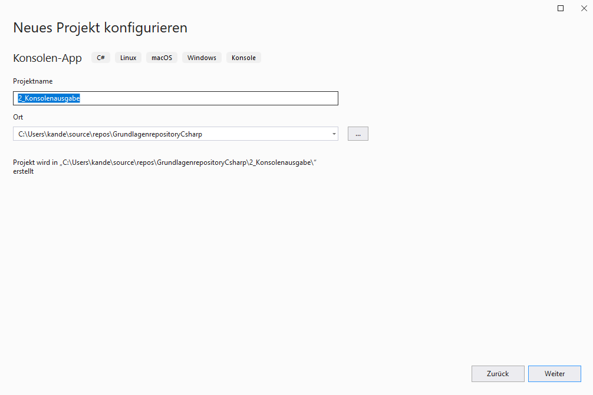

### Projekt wechseln

Ändern Sie die den Text in der neuen Program.cs von ```Hello World`` in ``Fubar``. 

Starten Sie den Debugger und schauen was ausgegeben wird.


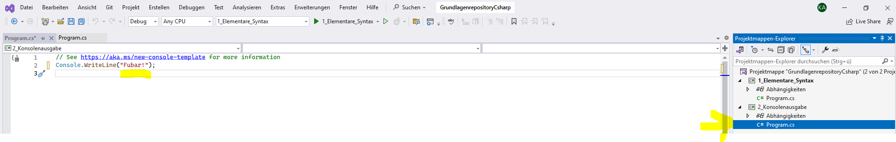


Klicken Sie mit der rechten Maustaste auf das neue Projekt und legen sie dieses als neues Startprojekt fest.


### Zur Quellcodeverwaltung hinzufügen

Damit Ihr Projekt auch von den Vorteilen der Quellcodeverwaltung profitieren kann und mit Ihrem GitHub konto verbunden ist, 
muss es initialisiert werden. 

hierfür klicken Sie auf **"Zur Quellcodeverwaltung hinzufügen"** und anschließend auf Git.


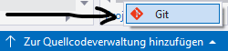


Visual Studio hat schon einige Einstellungen für Sie Vorgenommen. 
Sie müssen nun noch folgende Punkte Prüfen 

1. README.md hinzufgen. Das ist eine Datei die...
2. Wählen Sie welches über welches Konto Sie das Repository erstellen möchten
3. Wählen Sie wem das Repository gehört in diesem Fall soll es ihrem persönlichen Profil sein. Da Sie teil der GSO-Organisation sind, können sie den Besitz auch auf sie...
4. Beschreiben Sie klurz was in dem Repository steckt
5. Laden Sie das Repository hoch.

Das Repository ist nun **"Privat"** nur Sie können es sehen. Sie können in den GitHub Einstellungen im Browser diese Einstellung später ändern.


Schauen Sie sich nun Ihr Repository in Ihrem persönlichen Profil bei GitHub an.


### Commit und Push

Bei der Arbeit mit Visual Studio und Github werden Sie zwei Fenster besonders heufig brauchen

- Projektmappenexplorer
- Git-Änderungen

Sie können diese Fenster immer über **'Ansicht/...'** öffnen. 

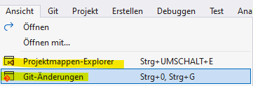

Nun wollen Wir eine Änderung in der Program.cs des ersten Projekts (**"1_Elementare_Syntax"**) vornehmen. 
Schreiben Sie unter die Vorhandene Codezeile eine Übersetzung der Konsolenausgabe. 

```csharp
Console.WriteLine("Hello World");
Console.WriteLine("Hallo Welt");
```

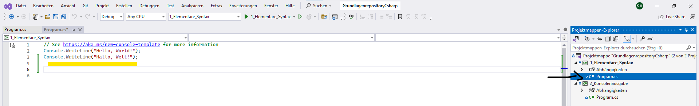

Nun klicken Sie in der Registerkarte auf

1. Git-Änderungen
2. Fügen Sie in die Commit-Box eine Beschreibung hinzu was Sie geändert haben. Nutzen Sie verben
3. Commiten Sie Ihre Änderungen.

Nun Können Sie im Browser schauen ob Ihre Änderung online zu sehen ist.

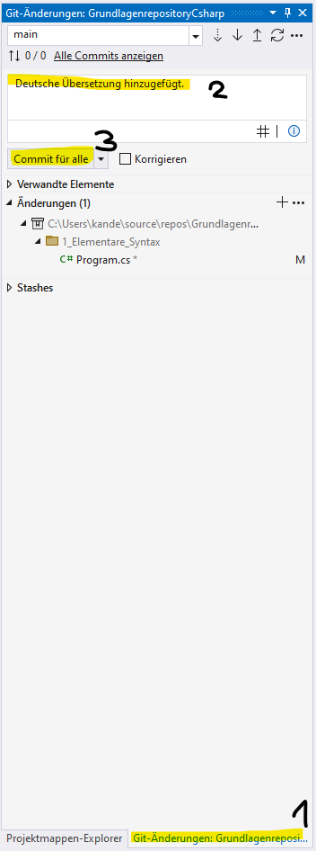

Wie Sie sicherlich gemerkt haben ist die zusätzliche Zeile nicht zu sehen. 
Das liegt daran...

Sie können Ihren Commit auf den Server pushen indem Sie den Button mit dem Pfeil nach oben anklicken. 
Hinweis:
Die 1 neben den Commits steht für ein commit der noch nicht gepsht wurde. 

Nachdem Sie ihren Code gepusht haben können kontrollieren on er im Browser zu sehen ist. 

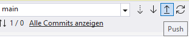

### Fetch und Pull

Es kann natürlich auch sein das sie Änderungen online im Browser machen oder ein Teamkollege seine Änderungen über einen PullRequest auf den Server geladen hat. 
Um diesen Code auf ihrem Lokalen zuladen, müssen sie den Code abrufen.

Gehen Sie im Browser zu Ihrem Repository GrundlagenrepositoryCsharp und zum Verzeichnis 2_Konsolenausgabe, 
Änderns Sie den Code folgendermaßen

Entfernen Sie 
```csharp
Console.WriteLine("Fubar");
```


mit folgender Codezeile
```csharp
Console.WriteLine("foobar");
```
Vergessen Sie nicht den Code zu Commiten. 

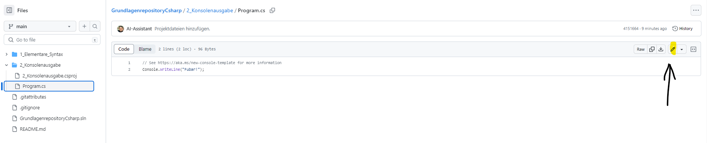

Um die Änderungen abzurfen öffnen Sie wieder die Registerkarte Git-Änderungen

1. Um die Daten Abzurufen, klicken sie den **gestrichelten** Pfeil nach **unten**
2. Es wird Ihnen nun eine Änderung angezeigt die auf dem Server vorgenommen wurde. Denken Sie daran noch ist diese Änderungen bei Ihnen Lokal noch nicht übernommen
3. Under dem Register Eingehend finden Sie den eingehenden Commit
4. Klicken Sie die Datei an in der der Commit gemacht würde
5. Schauen Sie sich die Änderung an
6. Um die Änderung zui übernehmen, klicken Sie auf den Pfeil nach **unten**

Schaeune Sie ob die Änderung lokal auf ihren Computer übernommen wurde.

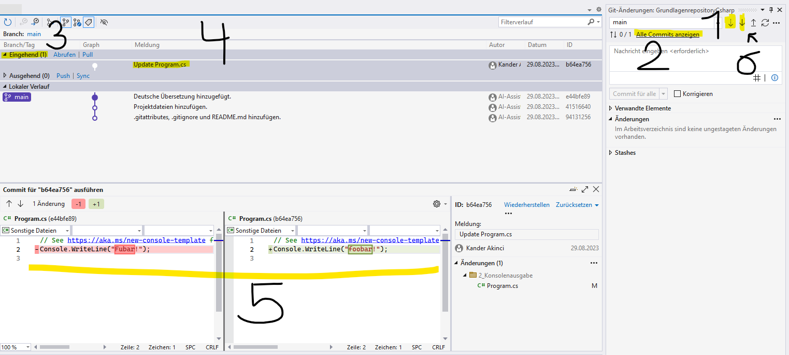

### Repository klonen

Die Speicherung auf dem Server hat viele Gründe. Einige davon sind die Sicherung und der Daten.

Schließen Sie nun Visual Studio vollständig.
Gehen Sie zu dem Ordner in dem Sie das Repository **"GrundlagenrepositoryCsharp"** gespeichert haben. 

Löschen Sie das Repository von ihrem Computer.

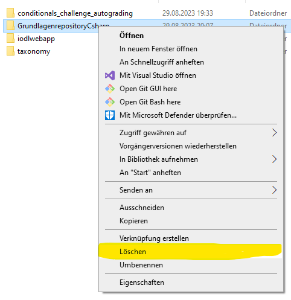

Öffnen Sie das Repoitory im Browser indem Sie ihre Repositorys aufrufen. 
Clicken Sie auf das **"GrundlagenrepositoryCsharp"** und anschließend auf **'Code'**.
Copieren Sie die HTTPS URL.

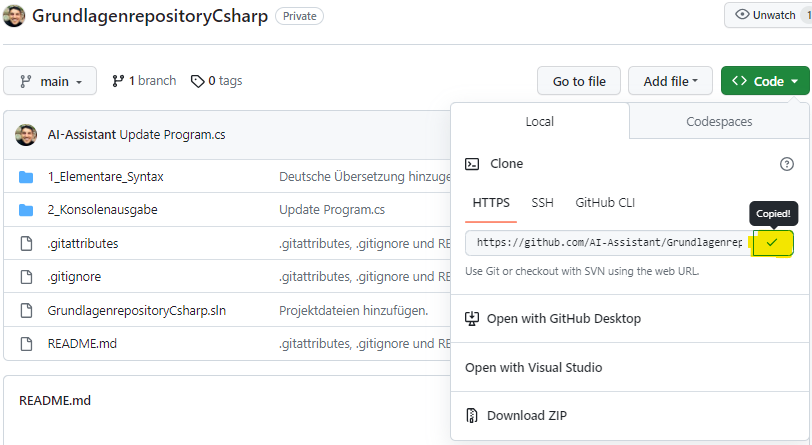

Starten Sie erneut Visual Studio auf ihrem Computer
Fahren Sie wie zu Anfang ohne Code fort. 
Unter dem Reiter Datei können auf Repository-klonen klicken

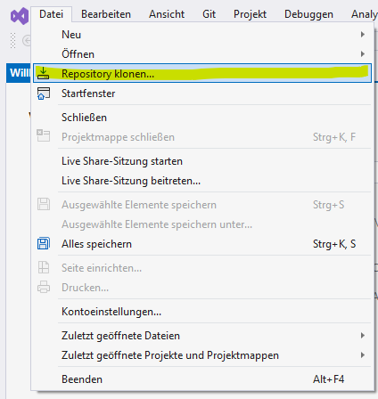

Fügen Sie die URL nun in das obere Feld ein und klicken Sie Klonen

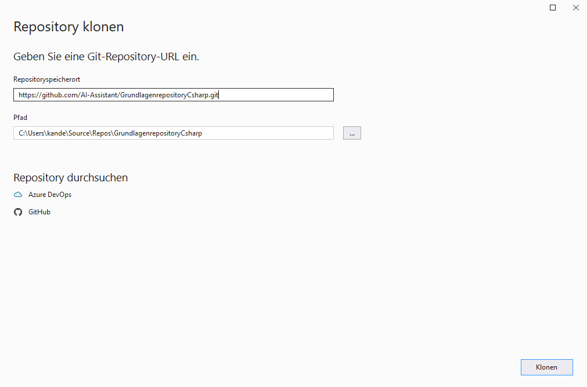

Nun ist das Repository wieder Auf Ihrem Computer und kann lokal verwendet werden.

