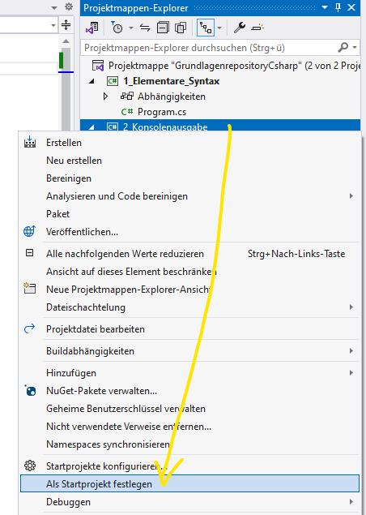

<div id="texts" style="display:inline; white-space:nowrap; float: right;"> 
        <h1>Visual Studio mit Git und GitHub</h1>
</div>

## :dart: Zielsetzung

### 1. Verständnis für die Entwicklungsumgebung
- Die Lernenden können **Visual Studio 2022** erfolgreich installieren, starten und die wichtigsten Funktionen der IDE identifizieren.

### 2. Anwendung von Versionierungssystemen
- Die Lernenden sind in der Lage, ein Projekt in Visual Studio zu erstellen und dieses mit einem Git-Repository zu verbinden.
- Sie verstehen die Bedeutung von Commits und können diese in Visual Studio durchführen.

### 3. Zusammenarbeit mit GitHub
- Die Lernenden können sich mit ihren Konten in Visual Studio anmelden.
- Sie können ein neues Repository auf GitHub erstellen, Änderungen pushen und ziehen (fetch und pull).
- Sie verstehen den Unterschied zwischen diesen Aktionen.

### 4. Arbeiten mit C#-Projekten
- Die Lernenden sind in der Lage, ein neues C#-Konsolenprojekt in Visual Studio zu erstellen.
- Sie können bestehende Projekte bearbeiten und verschiedene Projekte innerhalb einer Lösung verwalten.


## Einleitung

Die Integration von Visual Studio mit GitHub hat die Entwicklung und Zusammenarbeit von Software erheblich vereinfacht. In diesem Tutorial werden Sie durch den Prozess der Erstellung eines Projekts in Visual Studio 2022 geführt, seiner Verbindung mit einem GitHub-Repository und der Durchführung der grundlegenden Git-Operationen, die im Softwareentwicklungszyklus häufig verwendet werden. Nachdem Sie diesen Leitfaden befolgt haben, werden Sie über das notwendige Wissen verfügen, um Ihren Code effizient zu verwalten, Änderungen zu verfolgen und mit anderen Entwicklern zusammenzuarbeiten.

---


## Visual Studio Starten

Um Visual Studio 2022 zu starten, folgen Sie diesen einfachen Schritten:

1. Öffnen Sie die Windows-Suchleiste und geben Sie "Visual Studio 2022" ein.


2. Wählen Sie das entsprechende Suchergebnis aus, indem Sie darauf klicken.

3. Sollte ein Popup-Fenster erscheinen, klicken Sie auf **"ohne Code fortfahren"**.


## Kontoeinstellungen in Visual Studio 2022

Bevor Sie mit der Arbeit in Visual Studio 2022 beginnen, ist es wichtig, Ihr **Microsoft-Konto** und Ihr **GitHub-Konto** zu verknüpfen. Ein Microsoft-Konto ermöglicht Ihnen den Zugriff auf verschiedene Dienste von Microsoft und sichert Ihre Einstellungen in der Cloud. Ein GitHub-Konto wird benötigt, wenn Sie Ihre Projekte versionieren und online auf GitHub speichern möchten.

### 1. **Account anmelden**

- Navigieren Sie im Menü zu `Datei` > `Kontoeinstellungen`.


- Klicken Sie auf **"Anmelden"** und geben Sie Ihre Schul-E-Mail-Adresse ein, um sich bei Ihrem **Microsoft-Konto** anzumelden.


> **Hinweis**: Sollten Probleme bei der Anmeldung auftreten, wechseln Sie den Standardbrowser in den `Kontooptionen`.


### 2. **GitHub Konto hinzufügen**

- Nachdem Sie sich mit Ihrem Microsoft-Konto angemeldet haben, fügen Sie Ihr **GitHub-Konto** hinzu.
- Klicken Sie hierfür auf **"Hinzufügen"** und wählen Sie GitHub aus der Liste aus.


Nach erfolgreicher Anmeldung mit beiden Konten sollte Ihr Anmeldebildschirm wie folgt aussehen:


## Neue Projektmappe in Visual Studio 2022 erstellen

In diesem Abschnitt werden Sie lernen, wie Sie eine neue Projektmappe für ein Konsolenprogramm erstellen, das in der Programmiersprache **C#** geschrieben wird. Ein **Konsolenprogramm** ist eine Art von Anwendung, die in einem Konsolenfenster (auch bekannt als Befehlszeilenfenster) ausgeführt wird. Es besitzt keine grafische Benutzeroberfläche (GUI), stattdessen interagiert es mit dem Benutzer durch Texteingaben und -ausgaben.

### 1. **Projekt erstellen**

- Navigieren Sie im Menü zu `Datei` > `Neu` > `Projekt`.


- Geben Sie in die Suchleiste `Konsolen.App` ein und stellen Sie sicher, dass **C#** als gewählte Programmiersprache eingestellt ist.


### 2. **Projekt konfigurieren**

- Benennen Sie die Projektmappe im ersten Feld als **"GrundlagenrepositoryCsharp"** und das darin enthaltene Projekt als **"1_Elementare_Syntax"** im zweiten Feld.
- Es ist eine gängige Praxis, Repositorys im `source` Ordner des Benutzers zu speichern. Achten Sie darauf, die Projektmappe **nicht** im selben Verzeichnis wie das Projekt zu platzieren.


- Für dieses Tutorial wählen Sie die Framework-Version **.NET 6**.


Im Anschluss daran wird Visual Studio das Projekt initialisieren und Ihnen eine Übersicht über die erstellten Dateien und den Quellcode anzeigen.

## Projekt debuggen in Visual Studio 2022

Der **Debugger** ist ein essentielles Tool für Entwickler. Er ermöglicht es, den Programmcode Schritt für Schritt auszuführen, den Zustand von Variablen zu überwachen, Haltepunkte zu setzen und viele andere Aufgaben durchzuführen, die bei der Fehleridentifikation und -behebung helfen. Das Debuggen hilft dabei, das Verhalten und die Abläufe im Code besser zu verstehen, und ist daher ein unerlässliches Werkzeug bei der Softwareentwicklung.

### Debugger starten

- Um den Debugger zu starten, drücken Sie **F5** auf Ihrer Tastatur oder klicken Sie auf den grünen Pfeil in der Menüleiste.


Nach dem Starten des Debuggers wird Ihr Code im Debug-Modus ausgeführt. Sie können den Verlauf des Programms verfolgen, Haltepunkte setzen und den Wert von Variablen während der Laufzeit beobachten. Dies ist besonders nützlich, um das korrekte Verhalten des Codes zu überprüfen und mögliche Fehler oder Unstimmigkeiten zu identifizieren.

### Neues Projekt in bestehende Projektmappe hinzufügen

In Visual Studio können Sie mehrere Projekte innerhalb einer einzigen **Projektmappe** organisieren. Dies ermöglicht es, mehrere miteinander verbundene Projekte zentral zu verwalten. Hier zeigen wir Ihnen, wie Sie ein neues Projekt zu einer bereits existierenden Projektmappe hinzufügen:

1. **Projektmappe im Solution Explorer auswählen**: 
    - Klicken Sie im Solution Explorer auf die lilafarbene Projektmappe, die Ihr Hauptprojekt enthält.


2. **Kontextmenü öffnen und neues Projekt hinzufügen**:
    - Klicken Sie mit der rechten Maustaste auf die ausgewählte Projektmappe und wählen Sie die Option, ein neues Projekt hinzuzufügen.


3. **Projekteigenschaften festlegen**:
    - Geben Sie dem neuen Projekt den Namen **"2_Konsolenausgabe"**.
    - Achten Sie darauf, dass Sie das **.NET 6 Framework** als Zielplattform auswählen, um die Kompatibilität und Konsistenz zwischen Ihren Projekten sicherzustellen.


Nach Abschluss dieser Schritte ist das neue Projekt Ihrer bestehenden Projektmappe hinzugefügt und Sie können mit der Entwicklung innerhalb dieses neuen Projektes beginnen.

### Projekt zum Starten auswählen und ausführen

In einer **Projektmappe** mit mehreren Projekten in Visual Studio können Sie ein bestimmtes Projekt als Startprojekt festlegen. Das bedeutet, dass dieses Projekt beim Starten des Debuggers automatisch ausgeführt wird. Im Folgenden wird erläutert, wie Sie das Startprojekt ändern und überprüfen können, welche Ausgabe es erzeugt:

1. **Ändern des Quellcodes**:
    - Öffnen Sie die Datei `Program.cs` im neu hinzugefügten Projekt.
    - Ersetzen Sie den Text `Hello World` durch `Fubar`.
    - Speichern Sie die Datei.


2. **Projekt ausführen und Ausgabe überprüfen**:
    - Starten Sie den Debugger, um die Ausgabe des aktuellen Startprojekts zu überprüfen.
    - Sie sollten die Ausgabe `Fubar` im Konsolenfenster sehen, wenn das aktuelle Startprojekt das neu hinzugefügte Projekt ist.

3. **Startprojekt ändern**:
    - Wenn Sie die Ausgabe von `Hello World` statt `Fubar` sehen, bedeutet dies, dass das ursprüngliche Projekt immer noch als Startprojekt festgelegt ist.
    - Um das neu hinzugefügte Projekt als Startprojekt festzulegen, klicken Sie mit der rechten Maustaste auf den Projektnamen im Solution Explorer.
    - Wählen Sie "Als Startprojekt festlegen" aus dem Kontextmenü.




4. **Erneutes Überprüfen der Ausgabe**:
    - Starten Sie den Debugger erneut.
    - Diesmal sollte die Ausgabe `Fubar` im Konsolenfenster angezeigt werden, da das neu hinzugefügte Projekt nun als Startprojekt festgelegt ist.

Indem Sie das Startprojekt wechseln, können Sie sicherstellen, dass Sie immer das richtige Projekt in Ihrer Projektmappe ausführen und testen.

### Zur Quellcodeverwaltung hinzufügen

Damit Ihr Projekt auch von den Vorteilen der Quellcodeverwaltung profitieren kann und mit Ihrem GitHub konto verbunden ist, 
muss es initialisiert werden. 

hierfür klicken Sie auf **"Zur Quellcodeverwaltung hinzufügen"** und anschließend auf Git.


Visual Studio hat schon einige Einstellungen für Sie Vorgenommen. 
Sie müssen nun noch folgende Punkte Prüfen 

1. README.md hinzufgen. Das ist eine Datei die...
2. Wählen Sie welches über welches Konto Sie das Repository erstellen möchten
3. Wählen Sie wem das Repository gehört in diesem Fall soll es ihrem persönlichen Profil sein. Da Sie teil der GSO-Organisation sind, können sie den Besitz auch auf sie...
4. Beschreiben Sie klurz was in dem Repository steckt
5. Laden Sie das Repository hoch.

Das Repository ist nun **"Privat"** nur Sie können es sehen. Sie können in den GitHub Einstellungen im Browser diese Einstellung später ändern.


Schauen Sie sich nun Ihr Repository in Ihrem persönlichen Profil bei GitHub an.


### Commit und Push

Bei der Arbeit mit Visual Studio und Github werden Sie zwei Fenster besonders heufig brauchen

- Projektmappenexplorer
- Git-Änderungen

Sie können diese Fenster immer über **'Ansicht/...'** öffnen. 


Nun wollen Wir eine Änderung in der Program.cs des ersten Projekts (**"1_Elementare_Syntax"**) vornehmen. 
Schreiben Sie unter die Vorhandene Codezeile eine Übersetzung der Konsolenausgabe. 

```csharp
Console.WriteLine("Hello World");
Console.WriteLine("Hallo Welt");
```


Nun klicken Sie in der Registerkarte auf

1. Git-Änderungen
2. Fügen Sie in die Commit-Box eine Beschreibung hinzu was Sie geändert haben. Nutzen Sie verben
3. Commiten Sie Ihre Änderungen.

Nun Können Sie im Browser schauen ob Ihre Änderung online zu sehen ist.


Wie Sie sicherlich gemerkt haben ist die zusätzliche Zeile nicht zu sehen. 
Das liegt daran...

Sie können Ihren Commit auf den Server pushen indem Sie den Button mit dem Pfeil nach oben anklicken. 
Hinweis:
Die 1 neben den Commits steht für ein commit der noch nicht gepsht wurde. 

Nachdem Sie ihren Code gepusht haben können kontrollieren on er im Browser zu sehen ist. 


### Fetch und Pull

Es kann natürlich auch sein das sie Änderungen online im Browser machen oder ein Teamkollege seine Änderungen über einen PullRequest auf den Server geladen hat. 
Um diesen Code auf ihrem Lokalen zuladen, müssen sie den Code abrufen.

Gehen Sie im Browser zu Ihrem Repository GrundlagenrepositoryCsharp und zum Verzeichnis 2_Konsolenausgabe, 
Änderns Sie den Code folgendermaßen

Entfernen Sie 
```csharp
Console.WriteLine("Fubar");
```


mit folgender Codezeile
```csharp
Console.WriteLine("foobar");
```
Vergessen Sie nicht den Code zu Commiten. 


Um die Änderungen abzurfen öffnen Sie wieder die Registerkarte Git-Änderungen

1. Um die Daten Abzurufen, klicken sie den **gestrichelten** Pfeil nach **unten**
2. Es wird Ihnen nun eine Änderung angezeigt die auf dem Server vorgenommen wurde. Denken Sie daran noch ist diese Änderungen bei Ihnen Lokal noch nicht übernommen
3. Under dem Register Eingehend finden Sie den eingehenden Commit
4. Klicken Sie die Datei an in der der Commit gemacht würde
5. Schauen Sie sich die Änderung an
6. Um die Änderung zui übernehmen, klicken Sie auf den Pfeil nach **unten**

Schaeune Sie ob die Änderung lokal auf ihren Computer übernommen wurde.


### Repository klonen

Die Speicherung auf dem Server hat viele Gründe. Einige davon sind die Sicherung und der Daten.

Schließen Sie nun Visual Studio vollständig.
Gehen Sie zu dem Ordner in dem Sie das Repository **"GrundlagenrepositoryCsharp"** gespeichert haben. 

Löschen Sie das Repository von ihrem Computer.


Öffnen Sie das Repoitory im Browser indem Sie ihre Repositorys aufrufen. 
Clicken Sie auf das **"GrundlagenrepositoryCsharp"** und anschließend auf **'Code'**.
Copieren Sie die HTTPS URL.


Starten Sie erneut Visual Studio auf ihrem Computer
Fahren Sie wie zu Anfang ohne Code fort. 
Unter dem Reiter Datei können auf Repository-klonen klicken


Fügen Sie die URL nun in das obere Feld ein und klicken Sie Klonen


Nun ist das Repository wieder Auf Ihrem Computer und kann lokal verwendet werden.

